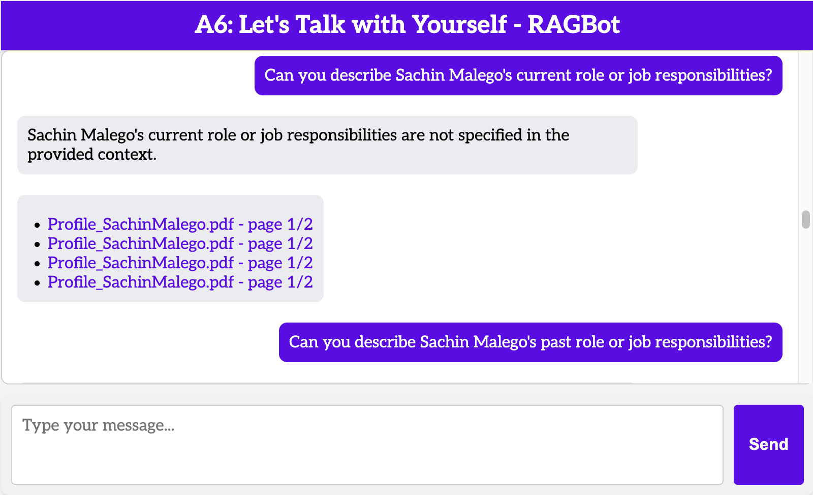

# A6-Lets-Talk-with-Yourself
This assignment applies RAG (Retrieval-Augmented Generation) techniques in Langchain framework to augment your chatbot that specializes in answering questions related to yourself, your documents, resume and any other relevant information.

For this task I have used my CV and Profile as a reference document which holds all the answers to the 10 questions that is to be answered about myself by the chat bot. The document can be downloaded from the link: [Download Document](https://drive.google.com/drive/folders/1WsGkfhqnxTYJMzgKL1IwmOW_xUIcGIws?usp=sharing)


#### **Analysis and Problem Solving**
1) Provide a list of the retriever and generator models you have utilized. (0.25 point)

2) Analyze any issues related to the models providing unrelated information. (0.25 point)

**Answers:** 
1. The list of retriever and generator models that I have used are:
    - **Retriever Models:**
        - Embedding Model used for this task is `hkunlp/instructor-base` from the HuggingFaceInstructEmbeddings
        - Vector Store used for this task is `faiss`
    - **Generator Model:**
        - The generator model used for this task is `Fast Chat Model` from the HuggingFacePipeline.
    
2. **Issues related to the models:**
    - **Unrelated Information:**
        - The model may give unrelated information to the user.
    - **Inaccurate Information:**
        - The model may give inaccurate information to the user.
    - **Missing Information:**
        - The model may not give all the information to the user.
    - **Duplicate Information:**
        - The model may give duplicate information to the user.
    - **Generation Errors:**
        - The model may generate errors in the response.
    - **Inconsistent Responses:**
        - The model may give inconsistent responses to the user.
    - **Lack of Contextual Information:**
        - The model may not give contextual information to the user.

Here’s a table summarizing the limitations of the retriever and generator models, along with possible solutions:  

| **Component**       | **Model Used**                  | **Limitations**                                                                                                                                   | **Possible Solutions**                                                                                               |
|---------------------|--------------------------------|--------------------------------------------------------------------------------------------------------------------------------------------------|----------------------------------------------------------------------------------------------------------------------|
| **Retriever Model** | `hkunlp/instructor-base`      | - May not generalize well to highly domain-specific queries. <br> - Embedding quality depends on training data. <br> - Struggles with complex queries requiring reasoning. | - Fine-tune the model on domain-specific data. <br> - Use hybrid retrieval (dense + keyword-based search).         |
| **Vector Store**    | `faiss`                        | - Doesn't support distributed indexing natively. <br> - Struggles with dynamic data updates (requires re-indexing). <br> - Lacks metadata filtering capabilities. | - Use alternatives like `Weaviate` or `Pinecone` for real-time updates. <br> - Implement approximate nearest neighbors (ANN) tuning. |
| **Generator Model** | `Fast Chat Model` (HuggingFacePipeline) | - May generate hallucinated responses. <br> - Performance varies with prompt engineering. <br> - Computationally expensive for long responses. | - Implement retrieval-augmented generation (RAG) for factual accuracy. <br> - Optimize inference with quantization techniques. |


#### **Chatbot Development - Web Application Development - Develop a web application that demonstrates a chatbot.**

1) The application should feature a chat interface with an input box where users can type messages.

2) Based on the user input, the model should generate coherent responses and also provide relevant source documents that support the generated response. For example, if the user types ”How old are you?”, the model might generate a concise summary along with links to related articles or documents. (0.5 point)

**Note:** You are encouraged to use any available resources related to your personal information, and ensure the chatbot provides accurate and relevant information.

**Answer:**
<h5><b>Application Interfaces</b></h5>

<p align="left">
  
  
  
</p>

<p align="left">
  
  
  
</p>

<p align="left">
  
  
  
</p>

<p align="left">
  
  
  
</p>

<p align="left">
  
</p>


<h5><b>Working of the Application</b></h5>

<a href="https://drive.google.com/file/d/1q6eV058XF1ocM1HKmgRMcOauFLtRoFEg/view?usp=sharing">Link to the application video</a>

<p align="left">
  
</p>

#### **Below are 10 questions your chatbot should be able to answer:**
1) How old are you?

2) What is your highest level of education?

3) What major or field of study did you pursue during your education?

4) How many years of work experience do you have?

5) What type of work or industry have you been involved in?

6) Can you describe your current role or job responsibilities?

7) What are your core beliefs regarding the role of technology in shaping society?

8) How do you think cultural values should influence technological advancements?

9) As a master’s student, what is the most challenging aspect of your studies so far?

10) What specific research interests or academic goals do you hope to achieve during your time as a master’s student?

**Submission Instructions:** For each question, your chatbot should generate a response. Please submit the question-answer pairs to your Github repository in the following JSON format:
```
[
{  
"question": "How old are you?",  
"answer": "Your answer here"  
},  
{  
"question": "What is your highest level of education?",  
"answer": "Your answer here"  
},  
...  
]
```

**Make sure that each question and corresponding answer is properly formatted in the JSON structure. This will be part of your deliverables. (0.5 point)**

<h5><b>JSON Responses</b></h5>
<p>The JSON Response is saved in the chatbot_responses file.</p>

```
[
{'question': 'How old is Sachin Malego?',
  'answer': 'Sachin  Malego  is  30  years  old.'},

 {'question': "What is Sachin Malego's highest level of education?",
  'answer': "Sachin  Malego's  highest  level  of  education  is  a  Master  of  Science  in  Data  Science  and  Artificial  Intelligence  from  the  Asian  Institute  of  Technology  (AIT),  Thailand."},

 {'question': 'What major or field of study did Sachin Malego pursue during his education?',
  'answer': 'Sachin  Malego  pursued  a  Bachelor  of  Science  in  Computer  Science  and  Information  Technology  (B.Sc.  CSIT)  during  his  education.'},

 {'question': 'How many years of work experience does Sachin Malego have?',
  'answer': 'Based  on  the  information  provided  in  the  resume,  Sachin  Malego  has  over  10  years  of  work  experience.'},

 {'question': 'What type of work or industry have Sachin Malego been involved in?',
  'answer': 'Sachin  Malego  has  been  involved  in  the  field  of  Information  Systems  Design,  Data  Science,  Artificial  Intelligence,  and  Disaster  Risk  Reduction.  He  has  been  involved  in  various  roles  such  as  Web  Developer,  Data  Management  Officer,  and  Consultant.  He  has  also  provided  consultancy  services  to  national  and  international  organizations  and  has  contributed  to  academic  and  research  with  published  reports  and  case  studies.  He  has  a  diverse  skill  set  spanning  programming,  database  management,  AI  model  development,  GIS  mapping,  and  system  security.  He  has  been  involved  in  major  national  platforms  such  as  Asia  Shelter  Forum  2020  and  2021.'},

 {'question': "Can you describe Sachin Malego's current role or job responsibilities?",
  'answer': "I'm  sorry,  but  I  do  not  have  access  to  the  current  role  or  job  responsibilities  of  Sachin  Malego.  The  information  provided  in  the  context  does  not  mention  his  current  role  or  job  responsibilities.  Can  you  please  provide  more  context  or  details  about  his  current  role  or  job  responsibilities?"},

 {'question': "Can you describe Sachin Malego's past role or job responsibilities?",
  'answer': "Sachin  Malego's  past  role  or  job  responsibilities  include:  *  Web  Developer  and  Data  Management  Officer  at  Web  Fusion  Nepal  from  2013  to  2018,  where  he  led  software  development  projects,  managed  databases,  and  contributed  to  web  application  development.  *  Consultant  for  the  Government  of  Nepal  from  2018  to  2024,  designing  and  managing  critical  information  systems  for  disaster  risk  reduction,  including  the  Bipad  portal,  Reconstruction  Management  Information  System  (RMIS),  Resource  Management  System,  and  Volunteer  Management  System  (VMS).  *  Co-ordinator  with  stakeholders,  overseeing  IT  projects,  developing  training  programs,  ensuring  data  security,  and  supporting  policy-making  initiatives  through  data  analysis  and  visualization."},

 {'question': "What are Sachin Malego's core beliefs regarding the role of technology in shaping society?",
  'answer': "Sachin  Malego's  core  beliefs  regarding  the  role  of  technology  in  shaping  society  are:  1.  The  transformative  power  of  technology  in  shaping  society.  2.  The  importance  of  ethical  AI  practices  in  ensuring  technological  advancements  align  with  cultural  values  and  community  needs.  3.  The  need  to  leverage  data  science  and  AI  to  build  resilient  communities.  4.  The  need  to  develop  intelligent  systems  that  enhance  disaster  risk  assessment  and  response,  ultimately  contributing  to  sustainable  development  and  community  resilience."},

 {'question': 'How do you think cultural values should influence technological advancements?',
  'answer': 'Cultural  values  should  influence  technological  advancements  in  several  ways:  1.  Ethical  considerations:  Cultural  values  should  be  taken  into  account  when  designing  and  implementing  technological  systems  to  ensure  that  they  align  with  ethical  principles  and  respect  for  human  rights  and  privacy.  2.  Community  needs:  Cultural  values  should  be  taken  into  account  when  designing  and  implementing  technological  systems  to  ensure  that  they  are  accessible  and  inclusive  for  all  communities.  3.  Sustainability:  Cultural  values  should  be  taken  into  account  when  designing  and  implementing  technological  systems  to  ensure  that  they  are  sustainable  and  environmentally  friendly.  4.  Accessibility:  Cultural  values  should  be  taken  into  account  when  designing  and  implementing  technological  systems  to  ensure  that  they  are  accessible  and  inclusive  for  all  users.  5.  Eth'},

 {'question': "As a master’s student, what is the most challenging aspect of Sachin Malego's studies so far?",
  'answer': "As  a  master's  student,  the  most  challenging  aspect  of  Sachin  Malego's  studies  so  far  may  be  the  integration  of  advanced  AI  and  data  science  techniques  into  his  research  and  professional  work.  This  may  involve  balancing  the  need  to  develop  and  implement  AI  models  with  the  need  to  manage  and  analyze  large  amounts  of  data,  as  well  as  the  need  to  integrate  these  models  into  real-world  applications.  Additionally,  the  need  to  balance  the  need  to  develop  and  implement  AI  models  with  the  need  to  maintain  and  update  them  over  time  may  be  a  challenge.  Additionally,  the  need  to  balance  the  need  to  develop  and  implement  AI  models  with  the  need  to  maintain  and  update  them  over  time  may  be"},

 {'question': 'What specific research interests or academic goals do you hope to achieve during your time as a master’s student?',
  'answer': "Sachin's  research  interests  and  academic  goals  as  a  master's  student  include  leveraging  data  science  and  AI  to  build  resilient  communities,  enhance  disaster  preparedness,  and  develop  intelligent  decision-support  systems  that  optimize  resource  allocation  and  policy-making.  He  aims  to  develop  and  implement  AI-driven  solutions  in  disaster  management,  leveraging  his  expertise  in  AI,  predictive  analytics,  and  data-driven  solutions.  He  also  hopes  to  contribute  to  the  development  of  AI-driven  solutions  in  disaster  management  by  leveraging  his  knowledge  and  skills  in  data  science  and  AI.  Additionally,  he  aims  to  develop  and  implement  AI-driven  solutions  in  disaster  management  by  leveraging  his  expertise  in  data  science  and  AI."}

]
```
